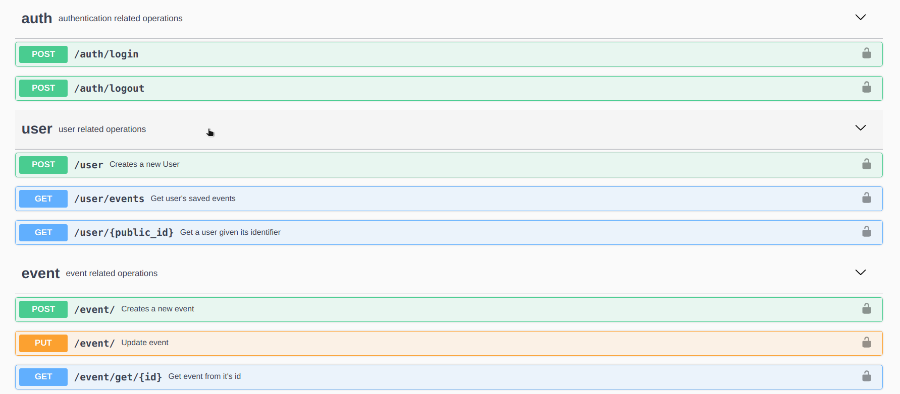

# Enotice REST

Frontend at: [notice-ui](https://github.com/snehalbaghel/notice-ui)

### Setup
0. MySQL
1. Install pipenv
2. ``` pipenv install ```
3. ``` pipenv shell ```
4. ``` python manage.py run ```

### Mirations

```bash
python manage.py db migrate --message 'migration message'
```
```bash
python manage.py db upgrade
```

### Docs

Flask-restx generated docs can be viewd at http://127.0.0.1:5000/docs



